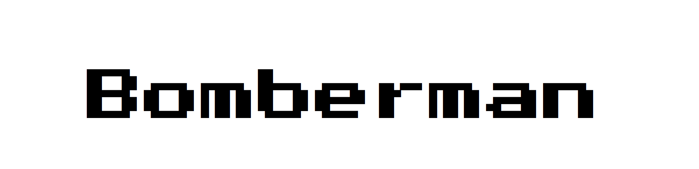
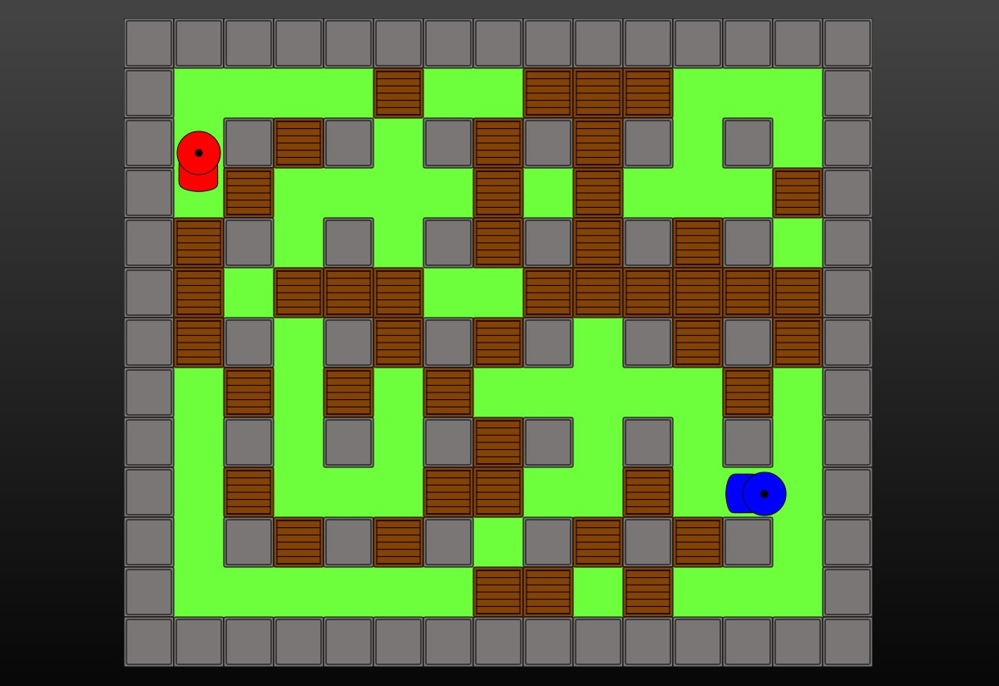

# 

# Bomberman  
## The Game
#### Bomberman a 2player game to challenge your friends in a boxy world and some explosions 
#### [Link to GameSite](https://p5-bomberman.netlify.app/)

## Installation
- clone/download
- start a development local Server, recommended live server in vscode

## Features
* Play  
    - [x] Walk around map
    - [x] Place bomb
    - [x] Break boxes with Bomb
    - [x] Die by Bomb explosion
    - [x] Frendly fire
* Start
    - [x] Set Player 1 and Player 2 name
    - [x] Game starts
* Restart
    - [x] Keep players name
    - [x] New game starts
* New game
    - [x] Set new Player 1 and Player 2 name 
    - [x] New game starts
* Controls Player 1:
    - [x] Movement: Arrow keys 
    - [x] Place Bomb: Period
* Controls Player 2: 
    - [x] Movement: WASD keys
    - [x] Place Bomb: Spacebar

## Built with
* [p5.js JavaScript library](https://p5js.org/)
* Vanilla JavaScript
* CSS/HTML

## Authors
* [Bernhard](https://github.com/Vehx)
* [Marcus Augustsson](https://github.com/MarcusIsCode)

## Testers  
  
### Code Review
#### &nbsp; By:  [Jesper Lundqvist](https://github.com/jesperlndqvst) & [Dominic Kersch](https://github.com/AltDom)
<!--review-->

